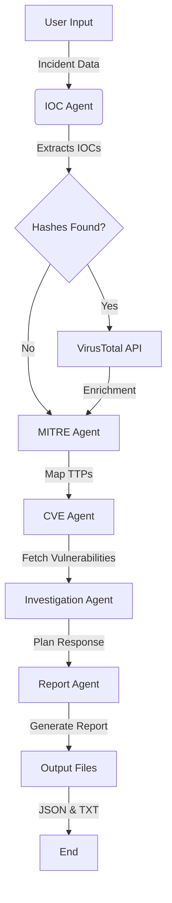

## Workflow

```mermaid
graph TD
    A[User Input] -->|Incident Data| B(IOC Agent)
    B -->|Extracts IOCs| C{Hashes Found?}
    C -->|Yes| D[VirusTotal API]
    C -->|No| E[MITRE Agent]
    D -->|Enrichment| E
    E -->|Map TTPs| F[CVE Agent]
    F -->|Fetch Vulnerabilities| G[Investigation Agent]
    G -->|Plan Response| H[Report Agent]
    H -->|Generate Report| I[Output Files]
    I -->|JSON & TXT| J[End]
```
